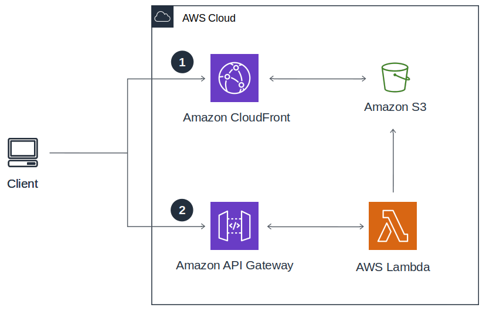
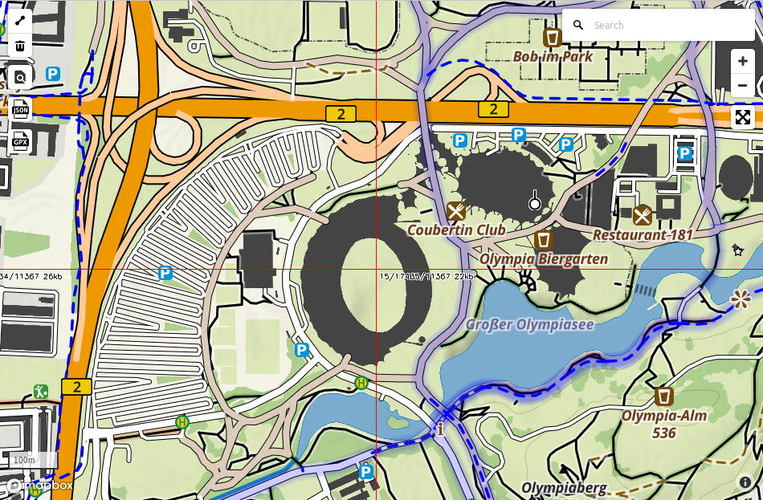
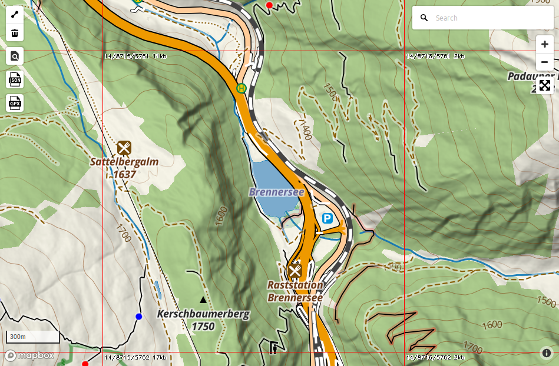

# Cloud-Tileserver

[](https://coveralls.io/github/henrythasler/cloud-tileserver?branch=master)

Serve mapbox vectortiles via AWS stack.

**THIS README IS WORK-IN-PROGRESS**

## Goals

These are the main project goals:

```
[✓] Setup the AWS infrastructure with terraform
[✓] Create an AWS lambda function to handle vectortile queries via REST
[✓] Create mapbox vectortiles directly with postgis using ST_AsMvtGeom() and ST_AsMVT()
[✓] Write a parser to read config-files that define the vectortiles layout
[ ] Create fully automated deployment pipeline.
[✓] Use some caching mechanism for vectortiles
[✓] Use Typescript and typed interfaces where possible
[✓] Have module tests with tsjest/chai
[ ] Generate useful documentation with typedocs
[ ] Learn more about AWS, terraform and typescript
[ ] Use free-tier if possible.
[✓] Have fun
```
Checked items are already fulfilled.

## Overall Architecture

1. Client requests tile from CloudFront/S3 .
2. Missing tiles are created via API Gateway and Lambda.



## Screenshots, Live Demo

The Live-Demo is available at: [cyclemap.link](https://cyclemap.link)

[](https://cyclemap.link/#15/48.17374/11.54676)

[](https://cyclemap.link/#14/47.01863/11.5046)

### TOML Source-Definition file

The Lambda-function is configured via a toml-file (`sources.toml`). during the build-process. The TOML-File **should** contain an array of `sources`. Each source **may** contain properties and **should** contain an array of `layers`. Each Layer **may** contain properties and **may** contain an array of `variants`.

```
[[sources]]
    property = foo
    (...)
    [[sources.layers]]
        property = bar
        (...)
        [[sources.layers.variants]]
            property = something
```

#### Layer Properties

property | type | description | default if not given
---|---|---|---
name | `string` | A name for the item. Must be alphanumeric + underscore [A-Za-z0-9_]. No special characters allowed. | (must be provided)
minzoom | `number` | minimum (greater-or-equal-than) zoom value where the layer must be provided | `0` 
maxzoom | `number` | maximum (less-than) zoom value where the layer must be provided | `32` 
geom | `string` | name of the geometry-column to be used in the vector tile | `"geometry"`
keys | `string[]` | array of column names that will be encoded besides the geometry column. May contain SQL-expressions.| `""`
where | `string[]` | array of conditions that will be used in the SQL-query as `WHERE`-Clause. Multiple conditions are concatenated with `AND` | `""`
prefix | `string` | SQL-Statement that will be inserted **before** the `ST_AsMvtGeom`-Function. Useful for `DISTINCT ON()`-Statements | `""`
postfix | `string` | SQL-Statement that will be inserted **after** the `WHERE`-Clause. Useful for `ORDER BY`-Statements | `""`
srid | `number` | identifier of the [spatial reference system](https://postgis.net/docs/manual-1.4/ch04.html#spatial_ref_sys) | `3857`
extend | `number` | tile extent in pixels (see [ST_AsMVTGeom](https://postgis.net/docs/manual-dev/ST_AsMVTGeom.html)) | `4096`
buffer | `number` | buffer in pixels around each tile (see [ST_AsMVTGeom](https://postgis.net/docs/manual-dev/ST_AsMVTGeom.html)) | `256`
clip_geom | `boolean` | clip geometries that lie outside the current tile incl. buffer (see [ST_AsMVTGeom](https://postgis.net/docs/manual-dev/ST_AsMVTGeom.html)) | `true`


## Software Design, Implementation Details

A more detailled description can be found in [DEVELOPMENT.md](DEVELOPMENT.md)